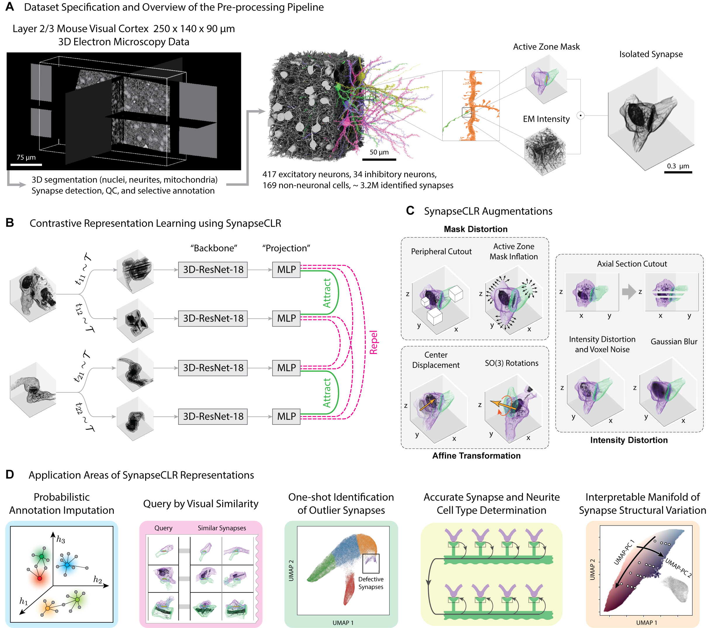

# SynapseCLR
A contrastive learning framework for navigating 3D electron microscopy data. A graphical overview of SynapseCLR pipeline and downstream applications is shown below.



# Navigating this Repository
SynapseCLR repository is organized as follows:
```
<repo_root>/
├─ pytorch_synapse/       # SynapseCLR Python packages
├─ configs/               # Sample configurations for pretraining SynapseCLR models
├─ data/                  # Processed 3D EM image chunks
├─ ext/                   # External resources (e.g. other pretrained models)
├─ output/                # SynapseCLR outputs (model weights, interactive analysis results)
├─ scripts/               # Helper scripts
├─ tables/                # Input and generated DataFrames
├─ notebooks/             # Notebooks for data pre-processing, interactive analysis, and reproducing paper figures
```

# Preprint and Citation
The bioRxiv preprint for SynapseCLR can be found [here](https://www.biorxiv.org/content/early/2022/06/09/2022.06.07.495207). The BibTeX citation is as follows:
```
@article {Wilson2022.06.07.495207,
	author = {Wilson, Alyssa M and Babadi, Mehrtash},
	title = {Uncovering features of synapses in primary visual cortex through contrastive representation learning},
	elocation-id = {2022.06.07.495207},
	year = {2022},
	doi = {10.1101/2022.06.07.495207},
	URL = {https://www.biorxiv.org/content/early/2022/06/09/2022.06.07.495207},
	eprint = {https://www.biorxiv.org/content/early/2022/06/09/2022.06.07.495207.full.pdf},
	journal = {bioRxiv}
}
```

# Authors
- Alyssa M. Wilson <alyssa.wilson@mssm.edu> (Icahn School of Medicine at Mount Sinai, New York, NY)
- Mehrtash Babadi <mehrtash@broadinstitute.org> (Data Sciences Platform, Broad Institute, Cambridge, MA)
