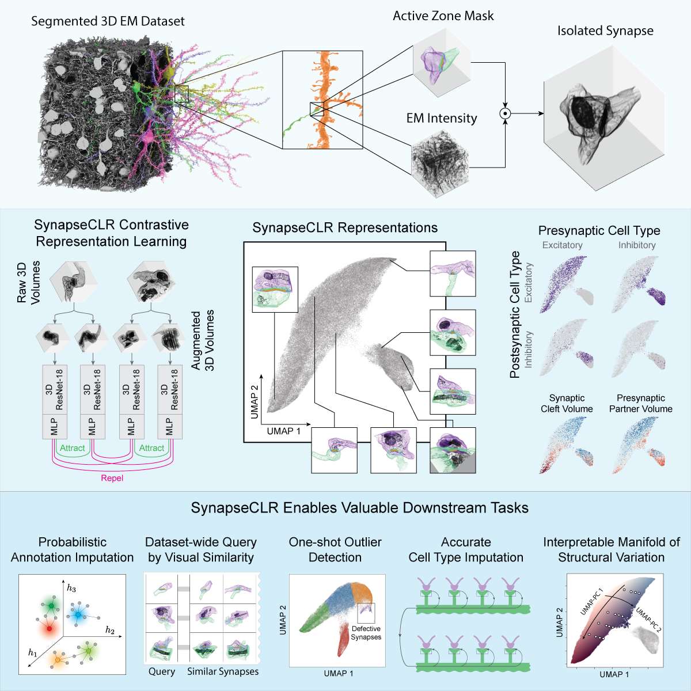

# SynapseCLR
SynapseCLR is a contrastive learning framework for navigating 3D electron microscopy data. A graphical overview of SynapseCLR pipeline and downstream applications is shown below:



# Navigating this Repository
The SynapseCLR repository is organized as follows:
```
<repo_root>/
├─ pytorch_synapse/       # SynapseCLR Python packages
├─ configs/               # Sample configuration files for pretraining SynapseCLR models
├─ scripts/               # Helper scripts
├─ notebooks/             # Notebooks for data preprocessing, interactive analysis, and reproducing paper figures
├─ data/                  # (not included in GitHub; see below) Raw and processed 3D EM image chunks
├─ ext/                   # (not included in GitHub; see below) External resources (e.g. other pretrained models)
├─ output/                # (not included in GitHub; see below) SynapseCLR outputs (pretrained models, extracted features, interactive analysis results)
└─ tables/                # (not included in GitHub; see below) Primary and derived resource tables
```

If you wish to _explore_ the results, a good starting point is browsing `notebooks` in GitHub. If you wish to _run_ the notebooks, you need to install `pytorch_synapse` and additionally download the contents of `data`, `output`, `ext`, and `tables` directories (not included in this GitHub repository, see below). Finally, if you wish to _pretrain_ SynapseCLR on your own 3D EM image chunks (not necessarily synapses, mind you; mitochondria anyone?), please follow the instructions given in `pytorch_synapse`. You will need to preprocess your data as described in `notebooks/01_data_preprocessing` and maybe modify the code according to the organization of your raw dataset. Feel free to contact us should you run into any problems!

# Data Download
You can download SynapseCLR raw and preprocessed data, pretrained models, resource tables, and analysis results from the public [SynapseCLR Terra workspace](https://app.terra.bio/#workspaces/broad-firecloud-dsde/SynapseCLR). Alternatively, the data can be directly downloaded from the following Google Bucket: `gs://fc-212b2d2b-6b73-4461-87a0-62164cd9b59a`. Please visit [here](https://cloud.google.com/storage/docs/uploads-downloads) to learn more about downloading data from Google buckets and [here](https://terra.bio) to learn more about Terra.

The data bucket includes the following contents:
```
<repo_root>/
├─ data/                  # Raw and processed 3D EM image chunks
├─ ext/                   # External resources (e.g. other pretrained models)
├─ output/                # SynapseCLR outputs (pretrained models, extracted features, interactive analysis results)
└─ tables/                # Primary and derived resource tables
```

# Preprint and Citation
The bioRxiv preprint for SynapseCLR can be found [here](https://www.biorxiv.org/content/early/2022/06/09/2022.06.07.495207). The BibTeX citation is as follows:
```
@article {Wilson2022.06.07.495207,
	author = {Wilson, Alyssa M and Babadi, Mehrtash},
	title = {Uncovering features of synapses in primary visual cortex through contrastive representation learning},
	elocation-id = {2022.06.07.495207},
	year = {2022},
	doi = {10.1101/2022.06.07.495207},
	URL = {https://www.biorxiv.org/content/early/2022/06/09/2022.06.07.495207},
	eprint = {https://www.biorxiv.org/content/early/2022/06/09/2022.06.07.495207.full.pdf},
	journal = {bioRxiv}
}
```

# Authors
- Alyssa M. Wilson <alyssa.wilson@mssm.edu> (Icahn School of Medicine at Mount Sinai, New York, NY)
- Mehrtash Babadi <mehrtash@broadinstitute.org> (Data Sciences Platform, Broad Institute, Cambridge, MA)
